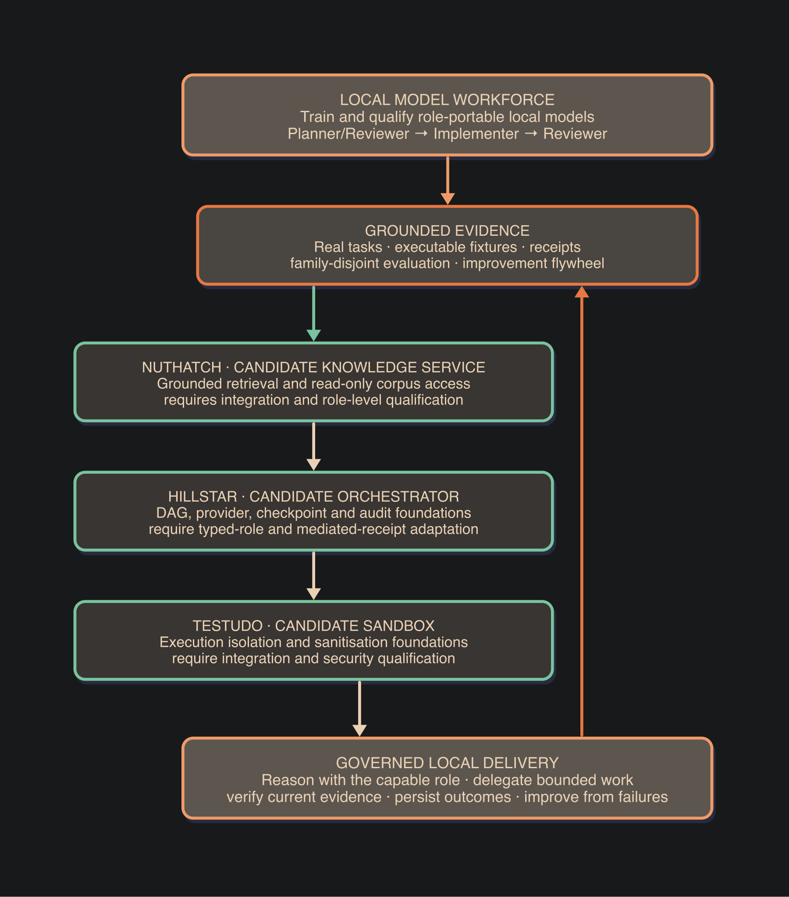

  <picture>
    <source media="(prefers-color-scheme: dark)" srcset="assets/readme-banner-dark.png">
    <source media="(prefers-color-scheme: light)" srcset="assets/readme-banner.png">
    
  </picture>

ML/AI engineer. Currently evaluating and hardening local LLMs on a
DGX Spark at home. Less interested in which model is generally
smartest, more in which specific capabilities hold up under the
conditions I actually run models in: life-science workloads,
reproducibility of academic-publication pipelines, and the coding
that ties both together.

## Showcase

<table>
  <tr>
    <td align="center" width="33%">
       
      <strong><a href="https://github.com/evoclock/nuthatch">nuthatch</a></strong>
    </td>
    <td align="center" width="33%">
       
      <strong><a href="https://github.com/evoclock/hillstar-orchestrator">hillstar-orchestrator</a></strong>
    </td>
    <td align="center" width="33%">
       
      <strong><a href="https://github.com/evoclock/testudo">testudo</a></strong>
    </td>
  </tr>
  <tr>
    <td valign="top">

- A knowledge-base layer for LLM-on-corpus workflows. Drop a paper corpus in, point an agent at it, get principled routing instead of "embed and pray"
- Read-only MCP query surface
- Schema-quarantined ingest with file-level validation
- Routing via a proprietary degree-corrected SBM
- Sub-community detection other graph-RAG lacks
- Per-tool token-economy accounting (BM25, card-sum)

</td>
    <td valign="top">

- A multi-provider LLM workflow orchestrator for research pipelines that need to be reproducible and auditable end-to-end
- Audit trails on top of GenAI tooling
- Per-step audit, lane-level concurrency

</td>
    <td valign="top">

- A hardened agent runtime for executing LLM-generated code in a sandboxed, auditable container
- Containerised end-to-end
- Sanitisation, MCP isolation, audit logs

</td>
  </tr>
</table>

## Working on today

- **[Local Model Workforce](https://github.com/evoclock/local-model-workforce).**
  This is the current phase of a longer design effort, not a project
  started today. The architecture was planned before implementation
  began in earnest on Friday, 17 July 2026. The work responds to a
  recurring problem in agentic development: capable models can plan
  useful work but still keep implementation inside an interactive
  session, route inconsistently, overlook repository conventions, or
  claim completion without current evidence.

  I am building a governed local-model system around portable roles:
  a 27B-35B Planner/Reviewer agrees the work, routes bounded
  implementation to a 4B-7B Implementer, and then reviews current
  evidence. The work covers executable training examples, fine-tuning,
  family-disjoint evaluation, mediated tools, durable receipts and a
  flywheel that turns verified failures into better models or stronger
  deterministic controls.

  The aim is not only to fine-tune a small coding model. The aim is to
  keep capable local reasoning while moving repeatable implementation
  into a cheaper role that follows the agreed contract.

  The diagram shows a candidate integration path. Nuthatch, Hillstar
  and Testudo are related foundations, not a currently integrated
  Local Model Workforce runtime. Each component requires adaptation
  and qualification against the role contracts and control boundaries.

  

## Thoughts

<strong>Fable manual Run 5 and CRUXEval-O consistency tests — 10 July 2026 onward</strong>

The Run 5 and CRUXEval-O prompt A/B results were published on
10 July 2026. The CRUXEval-O repeated-sampling follow-up is incomplete
and paused while the current Local Model Workforce tranche is active.

- **Run 5: a reasoning manual may help weaker models catch real
  errors.** On granite-4.0-h-small-FP8, the Fable manual doubled the
  catch rate on the 90-day retention trap: control 8/24, sham 7/24,
  manual 16/24. The placebo did nothing, so the signal is the manual's
  procedures, not generic carefulness. Caveat: n=24 per arm. [Read the
  writeup ->](https://htmlpreview.github.io/?https://gist.githubusercontent.com/evoclock/b539f39d06e12c3ef13e5c9892ba7ee0/raw/fable-run5-granite.html)

- **CRUXEval-O cons@k follow-up.** The 184-problem prompt A/B is
  published; the next question is how much of the **wrong under both**
  floor survives repeated sampling and majority vote. I am rerunning
  the same code-tracing set with multiple samples per problem across
  Nemotron-3-Super-120B-A12B-NVFP4, gemma-4-26B-A4B-it,
  Ornith-1.0-35B-FP8, Holo-3.1-35B-A3B-NVFP4,
  Qwen3.6-35B-A3B-NVFP4, Nemotron-3-Nano-30B-A3B-NVFP4,
  and granite-4.0-h-small-FP8. The A/B floor is an upper bound; cons@k
  asks which genuine tracing errors are stable and which ones disappear
  when the model gets more than one deterministic-looking chance to land
  on the right literal.

<strong>Current benchmark queue</strong>

This is the machine-facing eval queue. The date is intentionally not
embedded in the heading; this table should be regenerated from the
benchmark plan when the queue changes. When this project rotates out,
this table can be archived as a dated snapshot and the same shape reused
for the next active project. For the active narrative, see "Working on
today" above.

| benchmark / run | descriptor | role | metric | status |
|---|---|---|---|---|
| Fable operating-manual trap battery, Run 5 | granite-4.0-h-small-FP8 tier-X control/sham/manual run; 90-day retention trap; manual 16/24 vs control 8/24 and sham 7/24 | reasoning discipline / reviewer stressor | arm delta | done: H1 |
| CRUXEval-O supplement cons@k | 184 code-tracing problems, repeated samples after prompt A/B | reviewer | cons@k + pass^k | running |
| AIME 2024 + 2025 | 60-problem balanced reasoning subset across contamination-baseline and post-cutoff years | reviewer + planner | cons@k + pass^k | queued |
| tool-eval-bench | Deterministic tool-use and multi-turn orchestration scenarios | planner | pass@k + pass^k / harness trials | planned |
| LiveCodeBench v6 | Coding generation subset, rebuilt for stratification before publication | implementer | pass@k + pass^k | planned |
| HumanEval+ | 164-problem code generation set with per-problem checkpoints | implementer | pass@k + pass^k | planned |
| Terminal Bench hard subset | Hard terminal-agent tasks that test command planning, state tracking, recovery, and execution over a real shell workflow | planner finalist confirmation | pass@k + pass^k | planned |
| HMMT Feb25 + GPQA | Hard competition-math and graduate science QA, run with and without tools to check whether reviewer finalists can verify difficult reasoning rather than only trace code | reviewer finalist confirmation | cons@k + pass^k | planned |

Seat shorthand follows the way Hillstar-style multi-agent
orchestrators divide work: **reviewer** reads and checks reasoning or
code, **planner** chooses tools and orders work, and **implementer**
writes code or concrete artifacts. The final public reports should
separate selection runs from finalist-confirmation runs so expensive
confirmation probes do not get mixed with the cheaper full-panel sweeps.

<strong>I recently got a DGX Spark, then I got curious</strong>

DGX Spark at home, more ideas than time, and a specific use case pulling
harder than the others. The general question I keep coming back to isn't
"which model is generally smarter"; it's "which model holds the *seat*
I need it to hold, and what do I do when it doesn't." That decomposes
into three things I want a battery to actually measure:

- Per-model failure modes: what does this model get wrong, and under
  what conditions? Authority pressure, buried ledes, re-derivation,
  drift under a long context, the things a leaderboard score doesn't
  surface.
- Per-seat benchmarking: different roles in an agentic setup (planner,
  retriever, executor, critic) need different strengths. A general
  benchmark averages over the wrong axis; I want to know which model
  wins which seat, and on what evidence.
- Intervention levels: when a model fails, the fix lives at one of
  several levels, fine-tuning, harness engineering, prompt/context
  distillation, OPRO / promptbreeding-style search. Different failures
  want different fixes; conflating them is the expensive mistake.

What I want from a benchmark, broadly:

- A pass-or-fail signal on the thing the model is actually being
  asked to do, not a composite score.
- A way to see which failure mode fires when it fails, not just that
  it failed.
- A methodology that points at which rung of the intervention ladder
  the result wants, based on what the eval surfaces, not on what was
  assumed going in.

<strong>Memory management for LLM-on-corpus</strong>

Not an exhaustive list, but if you have an interest in memory
management, these are some of the areas I have been experimenting on
or validating against:

- **Parametric** (Mamba, SSMs, Jamba hybrids; [Gu & Dao
  2023](https://arxiv.org/abs/2312.00752)) compresses context into a
  bounded recurrent state during inference. Deterministic for a given
  input, ephemeral across calls.
- **Chain-of-thought.** The model's own scratchpad; pays tokens for
  working memory on every call. Poor ROI for the token cost and
  overhead.
- **External flat RAG** (vector similarity, BM25). Memory in an index;
  freshness wins, recall is bounded by embedding quality.
- **Graph-RAG.** Same external memory, but with structure (nodes,
  edges, communities). The partitioning algorithm is what separates
  the principled tools from the embedding-only ones. Microsoft's
  GraphRAG uses [Leiden community
  detection](https://arxiv.org/abs/2404.16130); [nuthatch](https://github.com/evoclock/nuthatch)
  is the proprietary SBM-based entry in this space.

Worth saying why frontier labs might not be too eager to solve this:
the more rounds you need to take to solve a problem, the more tokens
you burn, and that is ultimately in their commercial interest.

<strong>Fable trap battery eval (Sonnet 5 A/B), published</strong>

9 traps across 8 failure modes, control arm vs the arm that read a
reasoning "operating manual" written by Claude Fable 5. 9/9 pass on
both arms; the manual lifted the fingerprint score (3.6 -> 4.9 / 5)
without changing which traps fired. The framing for this one came from
a post on X by
[@alex_prompter](https://x.com/alex_prompter/status/2074186423121690765)
suggesting the Fable 5 operating manual should be portable into
Opus 4.8. The trap battery was a way of testing whether "portable"
means *capability* or *communication discipline*. The eval lands on
the latter. [Read the writeup ->](https://htmlpreview.github.io/?https://gist.githubusercontent.com/evoclock/d80dd9b13ac8f7c2e8f9565285702588/raw/trap_eval.html)

<strong>Capability-grade screen (Sonnet 5, Run 3), published, uninformative by design</strong>

Three arms (control / sham / real manual) on three difficulty tiers
(easy / medium / hard), n=3 per cell = 27 agents, single-turn, model
held constant. Result: 27/27 pass. Control, sham, and manual all
correct at every tier, including hard. The pre-registered calibration
gate fired as designed: control must fail 25-75% to give the manual
headroom, and it failed 0%, so by the rule all three tasks are cut.
With no failures to flip, this run is uninformative about capability,
not evidence the manual doesn't help, just evidence this task family
can't test it at Sonnet tier.

The sham arm did its job. On correctness, sham = manual = control.
On style, manual > sham > control, but the sham closed most of the
care-gap, so the style effect is mostly priming ("any careful-sounding
preamble"), not the manual's specific procedures. The markers unique
to the real manual (provenance grades, named disconfirming test,
explicit independent re-derivation route) appear only in the manual
arm; the shared "careful-sounding prose" is what the sham reproduces.

Three converging runs at the same wall: Run 1 (Opus control vs
placebo manual, never read the file), Run 2 (Sonnet + real manual,
single-turn), Run 3 (Sonnet + sham + 3 tiers). All three saturate.
The ceiling is the model, not the manual. The recommended next step
is a weaker base model that fails these single-turn traps 30-50% of
the time, reusing the whole battery + sham design unchanged. Run 4
picked that up (Qwen3.6-35B local vLLM, H0) and is published
below. [Read the writeup ->](https://htmlpreview.github.io/?https://gist.githubusercontent.com/evoclock/b253c018f36e262b1e1abff72a46e7ae/raw/screen_eval.html)

<strong>Capability-grade screen (Qwen3.6-35B, Run 4), published, H0</strong>

Same three-arm battery, single-turn, sham manual unchanged. The
change is the model: Sonnet is gone, Qwen3.6-35B served locally via
vLLM, thinking off, temp 0.7, n=8 per arm. Plus a new harder trap (X:
a 90-day retention / cumulative-storage worksheet where the agent had
to catch the days-in-month vs retention substitution, a 3x cost
understatement).

First time the calibration gate opened. The hard Simpson's reversal
calibrated at 2/8 control fail (25%), brushing the bottom of the
pre-registered 25-75% headroom band. The new X trap saturated at
0/8 control fail and was not armed. Run the 3-arm test on H with
the gate open.

H0, no capability effect. The arm run's independent control draw
produced 0/8 fails. Sham 8/8, manual 8/8, control 8/8. The 25% vs
0% gap across the two draws is sampling noise at n=8 and temp 0.7,
not a contradiction. The pre-registered rule calls all-arms-within-
15pp as H0, and that is the verdict. Headroom was marginal, not
durable, so there were no failures for the manual to flip.

The one genuine methodological learning is buried-reversal grading.
Qwen sometimes opens with the wrong verdict, re-derives mid-answer,
and lands on the right one in a labelled Conclusion or Recommendation
section. A naive first-word grader marks these wrong. The grader
now reads the labelled conclusion (falling back to the opening only
when there is no label) and strips markdown emphasis so `do **not**
ship` still parses as a negation. Every graded row was eyeballed
against the full answer; the FAILs are genuine ships-of-B.

Four runs converge. Sonnet (runs 1-3) saturates. Qwen3.6-35B
brushes the gate on H but can't sustain it. The single-turn
verify-an-artifact family is done. To detect a capability effect
the next move is either a still-weaker model (Nemotron-30B queued)
that fails H ~30-50% reliably, or a multi-step task family where
re-derivation has room to flip an answer.
[Read the writeup ->](https://htmlpreview.github.io/?https://gist.githubusercontent.com/evoclock/d190c2c8ebb94651ae7db7dc680c7e9f/raw/screen_eval_run4.html)

<strong>Capability-grade screen (granite-4.0-h-small-FP8, Run 5), published, H1</strong>

The important result is direct: on a weaker small open model, the
Fable operating manual appears to help catch a real buried reasoning
error. granite-4.0-h-small-FP8 was served locally as `granite-small`,
plain non-thinking mode, temp 0.7. Calibration selected tier X, the
90-day retention / cumulative-storage worksheet trap, because control
failed 10/16 times and therefore left room for the manual to matter.

The armed run landed the first positive H1 signal in the series:
control 8/24 (33%), sham 7/24 (29%), manual 16/24 (67%). The sham arm
is the key comparison. A same-length carefulness preamble did not help,
while the real Fable operating manual lifted the catch rate by about 34
percentage points over control. A pass required both refusing sign-off
and naming the specific 30-day versus 90-day storage error.

This is evidence that the manual's specific procedures may transfer
useful reasoning discipline to a small model on this trap family. The
caveat is sample size: n=24 per arm gives a signal, not a final
reliability estimate. The next step is the cons@k/pass^k rerun to see
whether the manual arm stays stable across repeated samples.
[Read the writeup ->](https://htmlpreview.github.io/?https://gist.githubusercontent.com/evoclock/b539f39d06e12c3ef13e5c9892ba7ee0/raw/fable-run5-granite.html)

<strong>CRUXEval-O 100-problem run (7 local models), published</strong>

First published instance of the reviewer-seat battery. 100 CRUXEval-O
problems (a subset, not classified by difficulty), 7 local models,
Python output prediction, deterministic grading via
`ast.literal_eval`. Final scores: Nemotron-3-Super-120B-A12B-NVFP4 98,
gemma-4-26B-A4B-it 98, Qwen3.6-35B-A3B-NVFP4 97,
Nemotron-3-Nano-30B-A3B-NVFP4 96, Ornith-1.0-35B-FP8 94,
Holo-3.1-35B-A3B-NVFP4 88, granite-4.0-h-small-FP8 81.
All 7 cards clean: 0 prompt/parse/harness exclusions.

The 18-point spread across 7 models is narrower than the raw
numbers suggest. Most of the headroom gap was prompt/parse artifact,
not model inability. The published writeup walks through every
fix: the gemma-4-26B-A4B-it code-reproduction recovery
(80 → 98), the Qwen3.6-35B-A3B-NVFP4 metavariable + example-answer + reasoning-bleed fix chain (84 → 97
across four prompt variants), the parse fix that recovered
trailing-junk false-fails across Qwen3.6-35B-A3B-NVFP4 and
Ornith-1.0-35B-FP8, and the targeted reruns on reasoning-bleed
fails for Ornith-1.0-35B-FP8 and Holo-3.1-35B-A3B-NVFP4. Read
the gist for the per-problem verdict and the issue log.

**Failure-mode distribution (post-clean, all genuine fails).**
Across the 7 models, 48 fail-pairs hit 28 distinct problems. 43
common (≥2 models hit the same problem, 90% of the pairs); 5
unique (1 model only, 10%). The common/unique split is the
substantive finding, not the scoreboard: a battery that surfaces
mostly common fails is testing *failure modes*, not *model
idiosyncrasies*. The 184-problem supplement published below
over-samples the high-frequency common modes to push this further.

The dominant mode is string-transform errors: off-by-char (10
pairs), truncation (5), case (3), short-string overproduce (2),
other (2) = 22 of 48 pairs (~46%). Container-shape errors are
the second cluster (~23%). The single hardest mode is
`dict_string` (4 models fail the one problem, s33), and only 1
more `dict_string` problem exists in the remaining 700, a hard
anchor that cannot be grown as a stratum. Numeric errors are
entirely unique to granite-4.0-h-small-FP8, confirming the weighting rule:
large pool, single-model, rare, so over-sampling numeric is
noise.

The data is what seeded the supplement (Regime B stratification)
and the failure-mode-driven analysis in
`benchmark-failure-modes.md`.
[7-model scoreboard ->](https://htmlpreview.github.io/?https://gist.githubusercontent.com/evoclock/5c294ce71af4d67c8d7580a83a4ab512/raw/cruxeval-o-results.html)

<strong>CRUXEval-O supplement A/B (184 problems, published)</strong>

A follow-up to the first CRUXEval-O run, using 184 code-tracing
problems across the same local-model setup on the DGX Spark. The
models were Nemotron-3-Super-120B-A12B-NVFP4, gemma-4-26B-A4B-it,
Ornith-1.0-35B-FP8, Holo-3.1-35B-A3B-NVFP4,
Qwen3.6-35B-A3B-NVFP4, Nemotron-3-Nano-30B-A3B-NVFP4, and
granite-4.0-h-small-FP8. Each model saw the same problems under the
baseline prompt and under a cleaner prompt plus a short per-model
system message.

The aggregate prompt delta is the wrong story. The effect is bimodal:
Holo-3.1-35B-A3B-NVFP4 and granite-4.0-h-small-FP8 gain because the
new prompt recovers formatting failures, while gemma-4-26B-A4B-it and
Qwen3.6-35B-A3B-NVFP4 regress because the mitigation breaks previously
correct answers. The useful signal is the **wrong under both** floor
after parser recovery. By that floor, the ranking is
Nemotron-3-Super-120B-A12B-NVFP4 (3), gemma-4-26B-A4B-it (6),
Ornith-1.0-35B-FP8 (9), Qwen3.6-35B-A3B-NVFP4 (12),
Nemotron-3-Nano-30B-A3B-NVFP4 (16), Holo-3.1-35B-A3B-NVFP4 (42),
granite-4.0-h-small-FP8 (54). The next experiment is cons@k voting:
repeat the task and see how much of that floor survives majority vote.

[Read the writeup ->](https://htmlpreview.github.io/?https://gist.githubusercontent.com/evoclock/5536ccec2b848b588ec4adaceefa20ef/raw/cruxeval-o-ab-184.html)

<strong>On cooling: 6.6W versus 35W, watts-per-token, and a desk-scale PUE argument</strong>

Sustained eval workloads are watts-bound on a desk-scale box. Using
an external Noctua NF-A14 industrialPPC-3000 (drawing 6.6W versus
the ~35W a desk fan pulls to move the same air through a hot chassis)
keeps watts-per-token down. That saves on power and prolongs the
hardware, and the watts/token argument is the main one. Same idea as
a datacenter PUE argument, just at desk scale.

