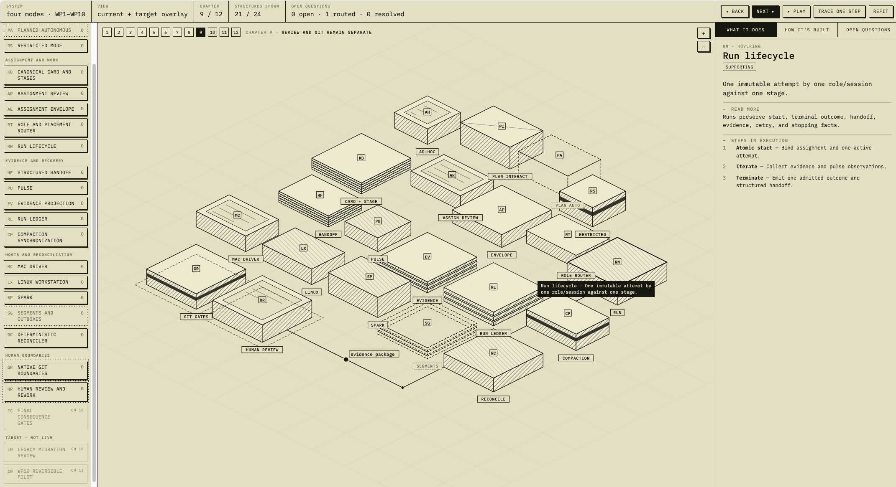

  <picture>
    <source media="(prefers-color-scheme: dark)" srcset="assets/readme-banner-dark.png">
    <source media="(prefers-color-scheme: light)" srcset="assets/readme-banner.png">
    
  </picture>

ML/AI engineer. Less interested in which model is generally
smartest, more in which specific capabilities hold up under the
conditions I actually run models in: life-science workloads,
reproducibility of academic-publication pipelines, and the infrastructure that make it possible.

## Showcase

<table>
  <tr>
    <td align="center" width="33%">
       
      <strong><a href="https://github.com/evoclock/nuthatch">nuthatch</a></strong>
    </td>
    <td align="center" width="33%">
       
      <strong><a href="https://github.com/evoclock/hillstar-orchestrator">hillstar-orchestrator</a></strong>
    </td>
    <td align="center" width="33%">
       
      <strong><a href="https://github.com/evoclock/testudo">testudo</a></strong>
    </td>
  </tr>
  <tr>
    <td valign="top">

- A knowledge-base layer for LLM-on-corpus workflows. Drop a paper corpus in, point an agent at it, get principled routing instead of "embed and pray"
- Read-only MCP query surface
- Schema-quarantined ingest with file-level validation
- Routing via a proprietary degree-corrected SBM
- Sub-community detection other graph-RAG lacks
- Per-tool token-economy accounting (BM25, card-sum)

</td>
    <td valign="top">

- A multi-provider LLM workflow orchestrator for research pipelines that need to be reproducible and auditable end-to-end
- Audit trails on top of GenAI tooling
- Per-step audit, lane-level concurrency

</td>
    <td valign="top">

- A hardened agent runtime for executing LLM-generated code in a sandboxed, auditable container
- Containerised end-to-end
- Sanitisation, MCP isolation, audit logs

</td>
  </tr>
</table>

## Working on today

A live feed of what is actually in progress.

- **[Agentic Driver](https://github.com/evoclock/pi-agentic-driver).** I am building a Pi extension set for dispatching a multi-model workforce by role, model, task and machine. It uses Herdr's native agent automation to create labelled panes or tabs, select models from the active Pi roster, communicate with workers, maintain useful warm sessions, and control persistent workspaces remotely over Tailscale and SSH. The latest fieldnote is **[Dispatching a Multi-Model Workforce from Anywhere](https://evoclock.github.io/fieldnotes/articles/herdr-natural-language-agent-automation.html)**.

- **[Methods-review extension](https://academic.oup.com/jamia/advance-article-abstract/doi/10.1093/jamia/ocag108/8709914?redirectedFrom=fulltext&login=false).** I am working on an extension to this paper that addresses the methodological approaches the authors did not pursue before making the claims in the original paper. I have invited the authors to collaborate on the extension and hope to be able to do so, but the work will be published regardless.

- **Pi harness and Scientific Workbench.** I have been working on modifications
  to my Pi harness and continuing work on my Scientific Workbench. The harness,
  as captured by the [System Atlas skill](https://github.com/inkboard/system-atlas),
  is below.

- **[Wrangling Qwen's Long Thinking Runs](https://evoclock.github.io/fieldnotes/articles/wrangling-qwens-long-thinking-runs.html)** 
  Qwen serving · 26 August 2026 
  How I manage Qwen's tendency to go off on a long reasoning run, why completion limits are not enough, and where quantisation creates a second serving problem.

## Fieldnotes: technical reports, experiments, evals and thoughts

  

<strong><a href="https://evoclock.github.io/fieldnotes/">fieldnotes</a></strong> 
Agent systems, models, evaluation and computational biology.

  
  

<strong>Agent systems</strong> (5)

Harnesses, gates, sandboxes, orchestration, and the products built on them.

- **[Dispatching a Multi-Model Workforce from Anywhere](https://evoclock.github.io/fieldnotes/articles/herdr-natural-language-agent-automation.html)**  
  Agent automation · 5 September 2026  
  How the Agentic Driver extension set uses Herdr and Pi to route tasks by role, model and machine, while keeping persistent sessions within reach from a laptop, phone or remote terminal.

- **[Wrangling Qwen's Long Thinking Runs](https://evoclock.github.io/fieldnotes/articles/wrangling-qwens-long-thinking-runs.html)** 
  Qwen serving · 26 August 2026 
  How I manage Qwen's tendency to go off on a long reasoning run, why completion limits are not enough, and where quantisation creates a second serving problem.

- **[And the Simpsons Already Did It](https://evoclock.github.io/fieldnotes/articles/primitives-were-already-there.html)** 
  Standards and prior art · 21 August 2026 
  Why AI infrastructure keeps rediscovering established primitives, and how to distinguish useful standardisation from inflated novelty claims.

- **[Memory management for LLM-on-corpus](https://evoclock.github.io/fieldnotes/notes/memory-management.html)**  
  Note · agent systems · 9 August 2026  
  Parametric state, chain-of-thought, flat RAG and graph-RAG are four answers to the same question, and the partitioning algorithm separates the principled tools from the rest.

- **[Why I Started Building a Local Multi-Model Workforce, and Why the Industry May Be Heading There Too](https://evoclock.github.io/fieldnotes/articles/local-multi-model-workforce.html)**  
  Multi-model systems · 30 July 2026  
  How a self-directed effort grew into a supervised multi-model architecture, a set of working products, and an emerging professional direction.

<strong>Models</strong> (5)

Adapting models to a job, and serving them on hardware I own.

- **[Wrangling Qwen's Long Thinking Runs](https://evoclock.github.io/fieldnotes/articles/wrangling-qwens-long-thinking-runs.html)** 
  Qwen serving · 26 August 2026 
  How I manage Qwen's tendency to go off on a long reasoning run, why completion limits are not enough, and where quantisation creates a second serving problem.

- **[Building a 4B Local Implementer](https://evoclock.github.io/fieldnotes/publications/project-brief.html)**  
  LLM fine-tuning · 29 July 2026  
  The task-bound Implementer, its behavioural adaptation, repeated coding evaluation, evidence flywheel and next steps.

- **[Building a 4B Local Implementer: technical report](https://evoclock.github.io/fieldnotes/publications/technical-report.html)**  
  Technical report · 27 July 2026  
  Training regime, paired evaluation across fifteen HumanEval+ runs, and what the numbers do and do not support.

- **[The prompt is not the model](https://evoclock.github.io/fieldnotes/evals/cruxeval-o-ab-184.html)**  
  CRUXEval-O · A/B · 10 July 2026  
  Seven models over 184 output-prediction problems. The headline change is meaningless on its own, the effect is bimodal, and the real signal is the floor.

- **[Seven local models on output prediction](https://evoclock.github.io/fieldnotes/evals/cruxeval-o-results.html)**  
  CRUXEval-O · reviewer seat · 8 July 2026  
  100 Python problems, graded strictly at Pass@1 and reported together with its prompt, infrastructure and harness failures.

<strong>Evaluation</strong> (10)

Designing a study, running it, and reporting what it did and did not show.

- **[Circadian ChIP-seq reproducibility audit](https://evoclock.github.io/fieldnotes/compbio/circadian-chipseq-audit.html)**  
  Reproducibility audit · 9 August 2026  
  A method reconstruction, sensitivity analysis and local ENCODE-equivalent comparison for public mouse liver circadian factor ChIP-seq. No tested condition reproduced both the deposited peak counts and the peak sets.

- **[Which model holds the seat, and what to do when it does not](https://evoclock.github.io/fieldnotes/notes/seat-benchmarking.html)**  
  Note · evaluation methodology · 9 August 2026  
  A leaderboard averages over the wrong axis. What matters is which model wins which seat, on what evidence, and which rung of the intervention ladder a failure points at.

- **[6.6W versus 35W, and a desk-scale PUE argument](https://evoclock.github.io/fieldnotes/notes/watts-per-token.html)**  
  Note · running the hardware · 9 August 2026  
  Sustained eval workloads are watts-bound on a desk-scale box, and the fan moving air through a hot chassis is a bigger share of that than it looks.

- **[Building a 4B Local Implementer: technical report](https://evoclock.github.io/fieldnotes/publications/technical-report.html)**  
  Technical report · 27 July 2026  
  Training regime, paired evaluation across fifteen HumanEval+ runs, and what the numbers do and do not support.

- **[A reasoning manual helped a small model catch the trap](https://evoclock.github.io/fieldnotes/evals/fable-run5-granite.html)**  
  Operating manual · run 5 · 10 July 2026  
  On granite-4.0-h-small-FP8 the manual raised the catch rate from 8/24 to 16/24, while a same-length placebo did nothing. Small n, stated plainly.

- **[The prompt is not the model](https://evoclock.github.io/fieldnotes/evals/cruxeval-o-ab-184.html)**  
  CRUXEval-O · A/B · 10 July 2026  
  Seven models over 184 output-prediction problems. The headline change is meaningless on its own, the effect is bimodal, and the real signal is the floor.

- **[The gate opened, and the manual still moved nothing](https://evoclock.github.io/fieldnotes/evals/screen_eval_run4.html)**  
  Capability screen · run 4 · 8 July 2026  
  A weaker base model and a harder trap gave the manual room to show a capability effect. It did not.

- **[Seven local models on output prediction](https://evoclock.github.io/fieldnotes/evals/cruxeval-o-results.html)**  
  CRUXEval-O · reviewer seat · 8 July 2026  
  100 Python problems, graded strictly at Pass@1 and reported together with its prompt, infrastructure and harness failures.

- **[The manual moved only the labels](https://evoclock.github.io/fieldnotes/evals/screen_eval.html)**  
  Capability screen · run 3 · 7 July 2026  
  Three arms, three tiers and twenty-seven agents, with a sham arm so a real capability effect would have had room to appear.

- **[It changed how the work was shown, not what was caught](https://evoclock.github.io/fieldnotes/evals/trap_eval.html)**  
  Trap battery · A/B · 7 July 2026  
  Nine traps, model held constant, one arm reading the operating manual and one not.

<strong>Computational biology</strong> (1)

Circadian genomics, phenome classification, and disease modelling.

- **[Circadian ChIP-seq reproducibility audit](https://evoclock.github.io/fieldnotes/compbio/circadian-chipseq-audit.html)**  
  Reproducibility audit · 9 August 2026  
  A method reconstruction, sensitivity analysis and local ENCODE-equivalent comparison for public mouse liver circadian factor ChIP-seq. No tested condition reproduced both the deposited peak counts and the peak sets.

