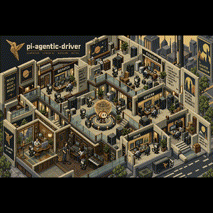
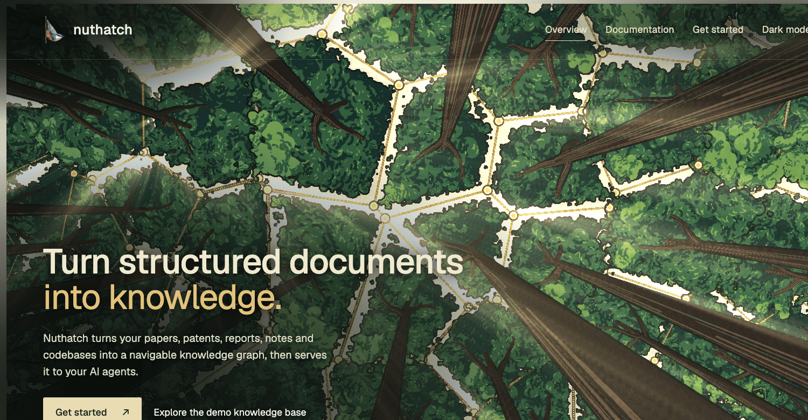
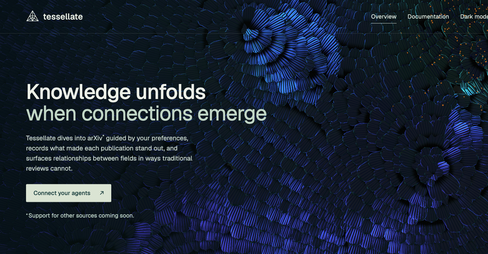
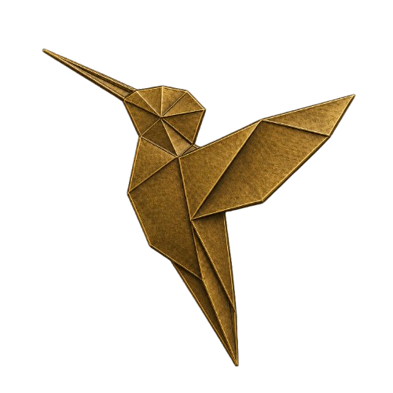
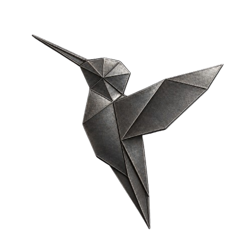
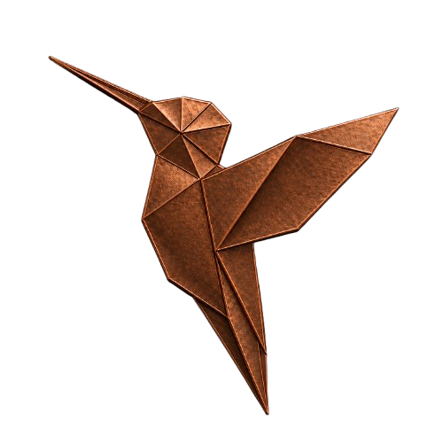

  <picture>
    <source media="(prefers-color-scheme: dark)" srcset="assets/readme-banner-dark.webp">
    <source media="(prefers-color-scheme: light)" srcset="assets/readme-banner.webp">
    
  </picture>

ML/AI engineer. Less interested in which model is generally
smartest, more in which specific capabilities hold up under the
conditions I actually run models in: life-science workloads,
reproducibility of academic-publication pipelines, and the infrastructure that make it possible.

## Showcase

<table>
  <tr>
    <td align="center" valign="middle" width="25%">
       
      <strong><a href="https://github.com/evoclock/nuthatch">nuthatch</a></strong>
    </td>
    <td valign="middle" width="75%">
      <ul>
        <li><strong>Turn structured files into navigable knowledge bases</strong> for LLM agents</li>
        <li><strong>Replace “embed and pray” with principled community structure</strong> built with a Bayesian SBM approach</li>
        <li><strong>Find sub-communities other graph-RAG misses</strong> while reducing token costs by <strong>76–99%</strong></li>
      </ul>
    </td>
  </tr>
  <tr>
    <td align="center" valign="middle">
       
      <strong><a href="https://github.com/evoclock/hillstar-orchestrator">hillstar-orchestrator</a></strong>
    </td>
    <td valign="middle">
      <ul>
        <li><strong>Provider-agnostic orchestration</strong> for reproducible research pipelines</li>
        <li><strong>End-to-end audit trails</strong> for every step and lane</li>
        <li><strong>Concurrent execution</strong> without sacrificing traceability</li>
      </ul>
    </td>
  </tr>
  <tr>
    <td align="center" valign="middle">
       
      <strong><a href="https://github.com/evoclock/testudo">testudo</a></strong>
    </td>
    <td valign="middle">
      <ul>
        <li><strong>Sandboxed execution</strong> for LLM-generated code</li>
        <li><strong>Hardened boundaries</strong> with sanitisation and MCP isolation</li>
        <li><strong>Auditable runs</strong> inside containerised environments</li>
      </ul>
    </td>
  </tr>
  <tr>
    <td align="center" valign="middle">
       
      <strong><a href="https://github.com/evoclock/pi-agentic-driver">pi-agentic-driver</a></strong>
    </td>
    <td valign="middle">
      <ul>
        <li><strong>Spawn and manage agents</strong> with native Pi/Herdr integration</li>
        <li><strong>Control scope creep and overengineering</strong> while preserving your context across sessions</li>
        <li><strong>Run automated agents in monitored sandboxes</strong> with safeguards and a kill switch against escape attempts</li>
      </ul>
    </td>
  </tr>
</table>

## Working on today

A live feed of what is actually in progress.

- **[Is fast decoding the be all and end all?](https://evoclock.github.io/fieldnotes/articles/is-fast-decoding-the-be-all-and-end-all.html)** 
  GLM-5.3-Flash serving · 9 October 2026 
  Four serving recipes for GLM-5.3-Flash on two DGX Sparks: TensorFold EXL3 with fc5:0.3, fnc7:0.3 and MTP drafting, and SparkGLM NVFP4. The recipe that answers fastest is not the one that generates fastest, and none of the four escapes the constraints that matter for real agent work. The explorable benchmark report is embedded in the entry.

- **A single source for all the tools I have been building.** Vogelkop has enabled me to produce the entirety of my PhD doctoral thesis work, and right now it is helping me build Tessellate to test a different kind of application, building products of a different type (not academic publications), and helping me debug along the way. In parallel I have been doing a little bit of frontend work, you will have noticed my banner has changed from a static De Jong attractor to an animated De Jong transitioning through to a Clifford, Thomas, and Aizawa attractors, that was, I am glad to say no Opus 5.5 one-shot prompting, it was built from the actual strange attractor formuli and then figuring out how to transition between them via some creative problem solving (12 attractors in total), additionally, while the initial rendering was done with Opus 5.5 half of the work was done with a local serve of GLM-5.3-Flash! Local AI ftw right?

That's work that will end in the website where all of the tooling I have built will live. Nuthatch has its own product page now and so does Tessellate. I have some big plans for Tessellate as an idea generator but that is as much as I am ready to say right now. A lot more to come soon enough.

  

  **Nuthatch**, as a reminder, is the tool you run your own collection of knowledge on: bring papers, patents, reports, notes, or any structured document, run the stages yourself or with an agent, via vogelkop or the command line and serve the resulting graph to your agents over MCP, with an Obsidian vault opening alongside for visualisation and consuming your curated knowledge base that isn't built on LLM-driven hallucination but graphRAG extraction of your documents. I have built a clean-room implementation of a Bayesian stochastic block model engine that is more permissive than the original tool and just as performant, which beats every typical network graph method in common use (Leiden and Louvain primarily). I will cover a little more on this on a different blog entry.

  What does all this mean to you? your knowledge base is built on ground truth, not LLM interpretation, and the relationships that come from the graph are tested more rigorously than other "second brain" methods out there give you, to boot, and this is a property of these systems, you get to save between 76% and 99% of all tokens you would otherwise spend if you were to query the information in the graph network.

  But how are Tessellate and Nuthatch different? Tessellate is designed to be very easy to run, you select the categories from a given journal's taxonomy and under the hood it goes and indexes everything published in that journal in the last week, it currently uses Jev to supplement much of the classification and then uses Budgie, a dual purpose reference capture and management tool I built which can retrieve papers from your chrome browser directly to your workspace, insert them into your manuscript draft, or in this case it can process any papers that failed the classification process with OpenAlex and Jev. Downstream it goes through the same pipeline as nuthatch but you are not expected to troubleshoot anything, Tessellate tells you if something failed to be classified and why and it will suggest what you may do about it. The net result is that you can query what Tessellate maintains for you automatically and your agent can learn at the same pace as you do about new developments in the fields that interest you.

  

## Fieldnotes: technical reports, experiments, evals and thoughts

  

<strong><a href="https://evoclock.github.io/fieldnotes/">fieldnotes</a></strong> 
Agent systems, models, evaluation and computational biology.

  
  

<strong>Agent systems</strong> (5)

Harnesses, gates, sandboxes, orchestration, and the products built on them.

- **[Dispatching a Multi-Model Workforce from Anywhere](https://evoclock.github.io/fieldnotes/articles/herdr-natural-language-agent-automation.html)**  
  Agent automation · 5 September 2026  
  How the Agentic Driver extension set uses Herdr and Pi to route tasks by role, model and machine, while keeping persistent sessions within reach from a laptop, phone or remote terminal.

- **[Wrangling Qwen's Long Thinking Runs](https://evoclock.github.io/fieldnotes/articles/wrangling-qwens-long-thinking-runs.html)** 
  Qwen serving · 26 August 2026 
  How I manage Qwen's tendency to go off on a long reasoning run, why completion limits are not enough, and where quantisation creates a second serving problem.

- **[And the Simpsons Already Did It](https://evoclock.github.io/fieldnotes/articles/primitives-were-already-there.html)** 
  Standards and prior art · 21 August 2026 
  Why AI infrastructure keeps rediscovering established primitives, and how to distinguish useful standardisation from inflated novelty claims.

- **[Memory management for LLM-on-corpus](https://evoclock.github.io/fieldnotes/notes/memory-management.html)**  
  Note · agent systems · 9 August 2026  
  Parametric state, chain-of-thought, flat RAG and graph-RAG are four answers to the same question, and the partitioning algorithm separates the principled tools from the rest.

- **[Why I Started Building a Local Multi-Model Workforce, and Why the Industry May Be Heading There Too](https://evoclock.github.io/fieldnotes/articles/local-multi-model-workforce.html)**  
  Multi-model systems · 30 July 2026  
  How a self-directed effort grew into a supervised multi-model architecture, a set of working products, and an emerging professional direction.

<strong>Models</strong> (6)

Adapting models to a job, and serving them on hardware I own.

- **[Is fast decoding the be all and end all?](https://evoclock.github.io/fieldnotes/articles/is-fast-decoding-the-be-all-and-end-all.html)**  
  GLM-5.3-Flash serving · 9 October 2026  
  Four serving recipes for GLM-5.3-Flash on two DGX Sparks. The recipe that answers fastest is not the one that generates fastest, and none of the four escapes the constraints that matter for real agent work.

- **[Wrangling Qwen's Long Thinking Runs](https://evoclock.github.io/fieldnotes/articles/wrangling-qwens-long-thinking-runs.html)** 
  Qwen serving · 26 August 2026 
  How I manage Qwen's tendency to go off on a long reasoning run, why completion limits are not enough, and where quantisation creates a second serving problem.

- **[Building a 4B Local Implementer](https://evoclock.github.io/fieldnotes/publications/project-brief.html)**  
  LLM fine-tuning · 29 July 2026  
  The task-bound Implementer, its behavioural adaptation, repeated coding evaluation, evidence flywheel and next steps.

- **[Building a 4B Local Implementer: technical report](https://evoclock.github.io/fieldnotes/publications/technical-report.html)**  
  Technical report · 27 July 2026  
  Training regime, paired evaluation across fifteen HumanEval+ runs, and what the numbers do and do not support.

- **[The prompt is not the model](https://evoclock.github.io/fieldnotes/evals/cruxeval-o-ab-184.html)**  
  CRUXEval-O · A/B · 10 July 2026  
  Seven models over 184 output-prediction problems. The headline change is meaningless on its own, the effect is bimodal, and the real signal is the floor.

- **[Seven local models on output prediction](https://evoclock.github.io/fieldnotes/evals/cruxeval-o-results.html)**  
  CRUXEval-O · reviewer seat · 8 July 2026  
  100 Python problems, graded strictly at Pass@1 and reported together with its prompt, infrastructure and harness failures.

<strong>Evaluation</strong> (10)

Designing a study, running it, and reporting what it did and did not show.

- **[Circadian ChIP-seq reproducibility audit](https://evoclock.github.io/fieldnotes/compbio/circadian-chipseq-audit.html)**  
  Reproducibility audit · 9 August 2026  
  A method reconstruction, sensitivity analysis and local ENCODE-equivalent comparison for public mouse liver circadian factor ChIP-seq. No tested condition reproduced both the deposited peak counts and the peak sets.

- **[Which model holds the seat, and what to do when it does not](https://evoclock.github.io/fieldnotes/notes/seat-benchmarking.html)**  
  Note · evaluation methodology · 9 August 2026  
  A leaderboard averages over the wrong axis. What matters is which model wins which seat, on what evidence, and which rung of the intervention ladder a failure points at.

- **[6.6W versus 35W, and a desk-scale PUE argument](https://evoclock.github.io/fieldnotes/notes/watts-per-token.html)**  
  Note · running the hardware · 9 August 2026  
  Sustained eval workloads are watts-bound on a desk-scale box, and the fan moving air through a hot chassis is a bigger share of that than it looks.

- **[Building a 4B Local Implementer: technical report](https://evoclock.github.io/fieldnotes/publications/technical-report.html)**  
  Technical report · 27 July 2026  
  Training regime, paired evaluation across fifteen HumanEval+ runs, and what the numbers do and do not support.

- **[A reasoning manual helped a small model catch the trap](https://evoclock.github.io/fieldnotes/evals/fable-run5-granite.html)**  
  Operating manual · run 5 · 10 July 2026  
  On granite-4.0-h-small-FP8 the manual raised the catch rate from 8/24 to 16/24, while a same-length placebo did nothing. Small n, stated plainly.

- **[The prompt is not the model](https://evoclock.github.io/fieldnotes/evals/cruxeval-o-ab-184.html)**  
  CRUXEval-O · A/B · 10 July 2026  
  Seven models over 184 output-prediction problems. The headline change is meaningless on its own, the effect is bimodal, and the real signal is the floor.

- **[The gate opened, and the manual still moved nothing](https://evoclock.github.io/fieldnotes/evals/screen_eval_run4.html)**  
  Capability screen · run 4 · 8 July 2026  
  A weaker base model and a harder trap gave the manual room to show a capability effect. It did not.

- **[Seven local models on output prediction](https://evoclock.github.io/fieldnotes/evals/cruxeval-o-results.html)**  
  CRUXEval-O · reviewer seat · 8 July 2026  
  100 Python problems, graded strictly at Pass@1 and reported together with its prompt, infrastructure and harness failures.

- **[The manual moved only the labels](https://evoclock.github.io/fieldnotes/evals/screen_eval.html)**  
  Capability screen · run 3 · 7 July 2026  
  Three arms, three tiers and twenty-seven agents, with a sham arm so a real capability effect would have had room to appear.

- **[It changed how the work was shown, not what was caught](https://evoclock.github.io/fieldnotes/evals/trap_eval.html)**  
  Trap battery · A/B · 7 July 2026  
  Nine traps, model held constant, one arm reading the operating manual and one not.

<strong>Computational biology</strong> (1)

Circadian genomics, phenome classification, and disease modelling.

- **[Circadian ChIP-seq reproducibility audit](https://evoclock.github.io/fieldnotes/compbio/circadian-chipseq-audit.html)**  
  Reproducibility audit · 9 August 2026  
  A method reconstruction, sensitivity analysis and local ENCODE-equivalent comparison for public mouse liver circadian factor ChIP-seq. No tested condition reproduced both the deposited peak counts and the peak sets.

